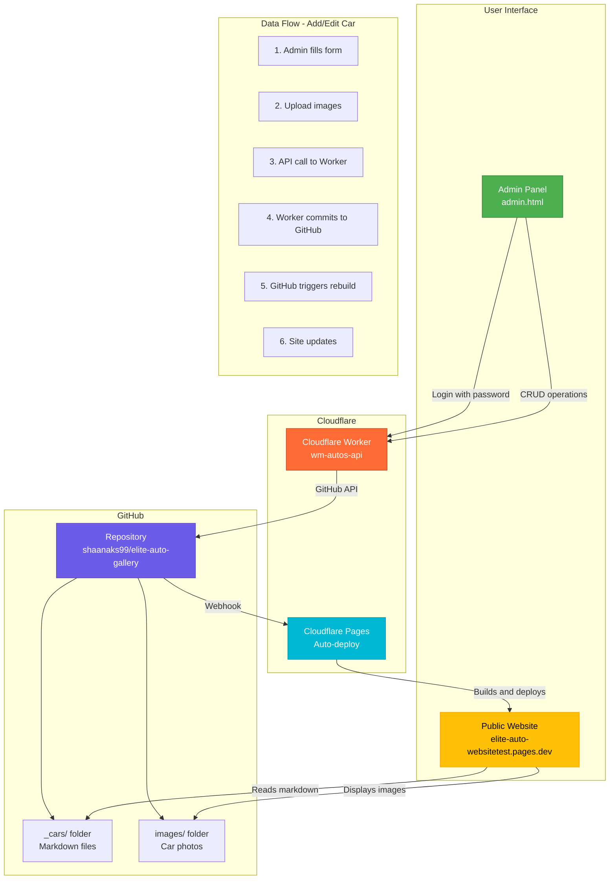

## Architecture Overview

### Components

1. **Admin Panel (`admin.html`)**
   - Single HTML file with embedded CSS and JavaScript
   - Form-based UI for managing cars
   - Handles image uploads and previews
   - Stores session token in browser

2. **Cloudflare Worker (`api.js`)**
   - Serverless API backend
   - Authenticates admin requests
   - Interfaces with GitHub API
   - Handles CRUD operations on markdown files
   - Uploads images to repository

3. **GitHub Repository**
   - Source of truth for all data
   - `_cars/` folder: Contains car listings as `.md` files
   - `images/cars/` folder: Stores uploaded car photos
   - Triggers Cloudflare Pages rebuild on push

4. **Cloudflare Pages**
   - Hosts the public website
   - Auto-rebuilds on GitHub commits
   - Serves static files
   - Fast global CDN

### Authentication Flow

```
User → Admin Panel → Enter Password → Worker checks password → 
If valid: Generate token → Store in sessionStorage → 
All subsequent requests include token → Worker validates token
```

### Car Addition Flow

```
1. Admin clicks "Add New Car"
2. Fills out form (make, model, year, price, etc.)
3. Uploads 1-10 images (converted to base64)
4. Clicks "Save Car"
5. JavaScript sends POST to Worker with JSON payload
6. Worker validates authentication
7. Worker processes images:
   - Generates unique filenames
   - Uploads to GitHub via API
   - Gets back file paths
8. Worker creates markdown file:
   - YAML frontmatter with car details
   - Description in body
   - Image paths array
9. Worker commits to GitHub
10. GitHub webhook triggers Cloudflare Pages
11. Site rebuilds (1-2 minutes)
12. New car appears on website
```

### Data Structure

**Markdown File (`_cars/2020-bmw-x5.md`):**
```yaml
---
make: BMW
model: X5
year: 2020
price: 35000
transmission: Automatic
fuelType: Diesel
mileage: 45000
availability: available
featured: true
images:
  - /images/cars/image1.jpg
  - /images/cars/image2.jpg
---

Stunning BMW X5 in excellent condition. Full service history...
```

### Security Layers

1. **Password Authentication**
   - Simple password check on worker
   - Token generation for session
   - Can be upgraded to GitHub OAuth

2. **GitHub Token**
   - Stored as encrypted environment variable
   - Has `repo` scope only
   - Can be revoked anytime

3. **CORS Headers**
   - Configured to accept requests from your domain
   - Prevents unauthorized API access

4. **Rate Limiting** (recommended addition)
   - Limit API requests per IP
   - Prevent abuse

### Why This Architecture?

✅ **No Database Needed** - Markdown files are your database
✅ **Version Control** - Every change tracked in Git
✅ **Fast Deployments** - Cloudflare's global CDN
✅ **Free Tier Friendly** - Works on free Cloudflare & GitHub plans
✅ **Simple to Maintain** - No server to manage
✅ **Backup Built-in** - GitHub is your backup
✅ **Easy to Migrate** - Just markdown files
✅ **SEO Friendly** - Static site generation

### Comparison to TinaCMS

| Feature | Your Custom CMS | TinaCMS |
|---------|----------------|---------|
| Setup Complexity | ⭐⭐ Simple | ⭐⭐⭐⭐⭐ Complex |
| Dependencies | None | Many npm packages |
| Configuration | 3 env variables | Multiple config files |
| Customization | Full control | Limited by framework |
| File Size | 1 HTML + 1 Worker | Large bundle |
| Learning Curve | Minimal | Steep |
| Cost | Free tier works | May need paid tier |

### Upgrade Path

This architecture is designed to grow with your needs:

1. **Phase 1 (Current):** Password auth, manual image upload
2. **Phase 2:** GitHub OAuth, image optimization
3. **Phase 3:** Multi-user support, roles
4. **Phase 4:** Analytics dashboard, email notifications
5. **Phase 5:** Mobile app, WhatsApp integration
